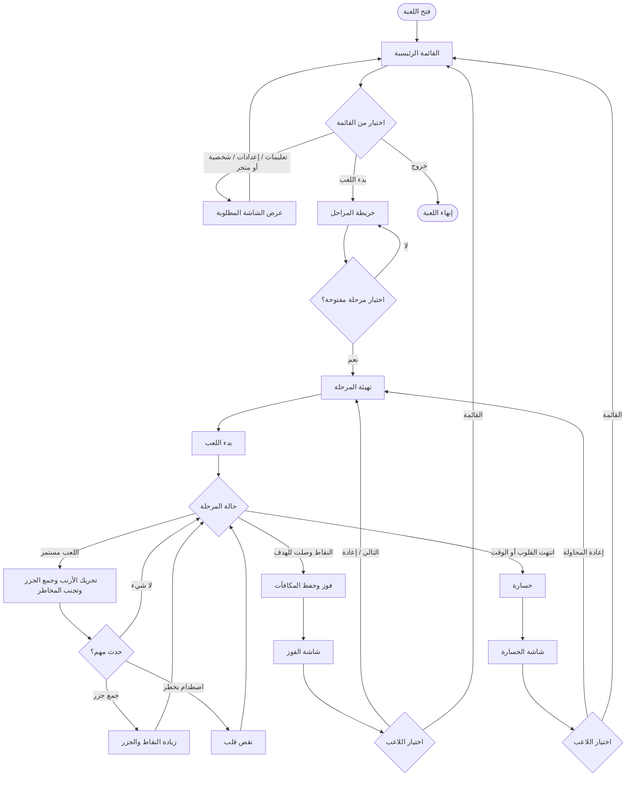
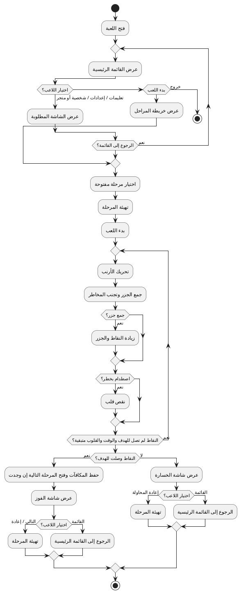

# مخطط النشاط المبسط للعبة Bunny Carrot Adventure

هذا الملف يعرض مخطط نشاط مختصر وواضح للعبة. الهدف من التبسيط هو جعل المخطط قويا وصحيحا بدون تفاصيل كثيرة داخل الرسم، مع الحفاظ على أهم مسار في اللعبة: الدخول من القائمة، اختيار المرحلة، اللعب، ثم الفوز أو الخسارة.

## الفكرة العامة للمخطط

1. يبدأ اللاعب من **القائمة الرئيسية**.
2. يمكنه فتح التعليمات أو الإعدادات أو متجر/اختيار الشخصية، ثم يرجع للقائمة.
3. عند بدء اللعب ينتقل إلى **خريطة المراحل**.
4. يختار اللاعب مرحلة مفتوحة، فتبدأ المرحلة ويتم ضبط النقاط والقلوب والوقت.
5. أثناء اللعب يكرر اللاعب الحركة وجمع الجزر وتجنب المخاطر.
6. إذا وصل إلى النقاط المطلوبة يفوز، وتحفظ المكافآت وتفتح المرحلة التالية إن وجدت.
7. إذا انتهت القلوب أو انتهى الوقت قبل تحقيق الهدف، يخسر.
8. بعد الفوز أو الخسارة يستطيع اللاعب إعادة المرحلة أو الرجوع للقائمة.

## مخطط النشاط المبسط بصيغة Mermaid

## مخطط النشاط المبسط بصيغة PlantUML

يمكن نسخ الكود التالي إلى أي أداة PlantUML لعرض المخطط كـ UML Activity Diagram.

## لماذا هذا المخطط أبسط وأقوى؟

- يجمع التفاصيل الصغيرة مثل الاندفاع، المؤثرات، وتحديث الواجهة داخل خطوة واحدة باسم **اللعب مستمر**.
- يركز على قرارات النشاط الأساسية فقط: بدء اللعب، اختيار مرحلة، فوز، خسارة، إعادة أو رجوع للقائمة.
- يحافظ على صحة منطق اللعبة: الفوز عند تحقيق النقاط المطلوبة، والخسارة عند نفاد القلوب أو انتهاء الوقت.
- مناسب للتقرير أو العرض لأنه قصير وسهل القراءة ولا يحتوي على تفرعات كثيرة.
