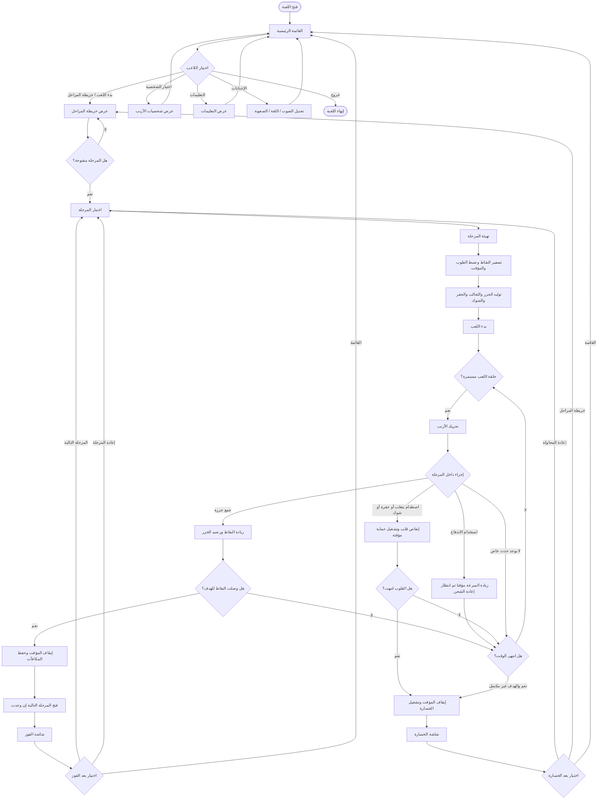
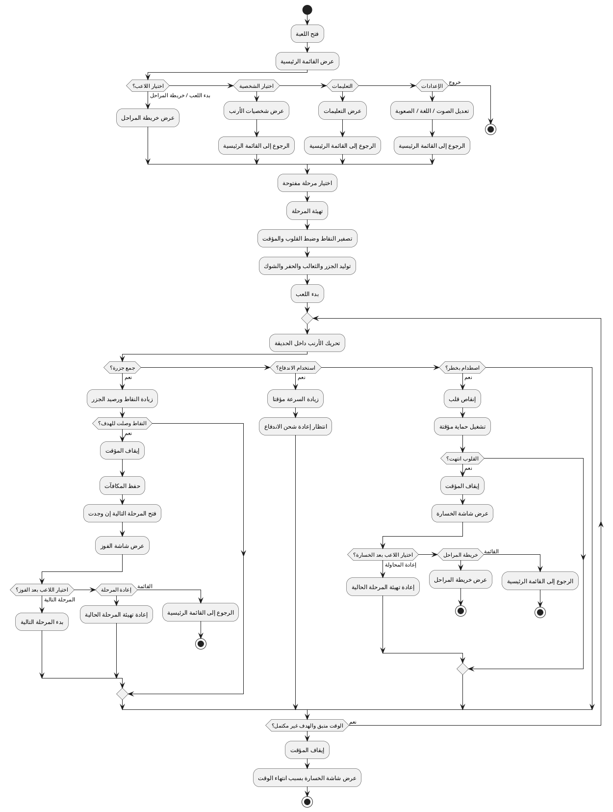

# مخطط النشاط للعبة Bunny Carrot Adventure

يوضح هذا الملف تدفق نشاط اللاعب داخل اللعبة من لحظة فتحها حتى الفوز أو الخسارة أو الرجوع للقائمة. المخطط مبني على حلقة اللعب الحالية: اختيار المرحلة، بدء اللعب، جمع الجزر، تجنب المخاطر، ثم الانتقال إلى شاشة الفوز أو الخسارة.

## ملخص التدفق

1. يبدأ اللاعب من القائمة الرئيسية.
2. يمكنه فتح التعليمات أو الإعدادات أو اختيار شخصية الأرنب، ثم الرجوع للقائمة.
3. عند بدء اللعب ينتقل إلى خريطة المراحل.
4. يختار اللاعب مرحلة مفتوحة.
5. تبدأ المرحلة بتصفير النقاط، ضبط القلوب، تشغيل المؤقت، وتوليد الجزر والمخاطر والثعالب.
6. يتحرك اللاعب داخل الحديقة ويكرر الأفعال التالية حتى نهاية المرحلة:
   - جمع الجزر لزيادة النقاط ورصيد الجزر.
   - استخدام الاندفاع للهروب أو الوصول بسرعة.
   - تجنب الثعالب والحفر والشوك.
   - خسارة قلب عند الاصطدام بخطر.
7. إذا وصلت النقاط إلى المطلوب قبل نفاد القلوب أو الوقت، يفوز اللاعب وتفتح المرحلة التالية.
8. إذا نفدت القلوب أو انتهى الوقت قبل الوصول للهدف، تظهر شاشة الخسارة.
9. بعد الفوز أو الخسارة يمكن للاعب إعادة المرحلة، اختيار مرحلة أخرى، أو الرجوع للقائمة الرئيسية.

## مخطط نشاط بصيغة Mermaid

## مخطط نشاط بصيغة PlantUML

يمكن نسخ الكود التالي إلى أي أداة PlantUML لعرضه كمخطط نشاط UML تقليدي.

