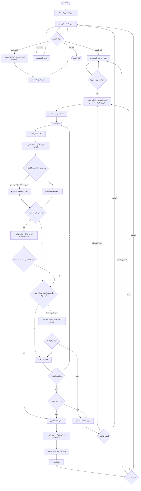
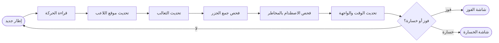

# لعبة الأرنب وجمع الجزر 🐰🥕

هذا الملف يشرح اللعبة بالكامل باللغة العربية: فكرة اللعبة، طريقة التشغيل، عناصر اللعب، مخطط انسيابي شامل، وأكواد زائفة توضّح منطق الأنظمة الأساسية.

## 1. نبذة عن اللعبة

**لعبة الأرنب وجمع الجزر** هي لعبة ثنائية الأبعاد مبنية بمحرك **Godot**. يتحكم اللاعب بأرنب داخل مستوى مليء بالجزر، الجزر الذهبية، الثعالب، الحفر، والأشواك. الهدف هو جمع نقاط كافية قبل انتهاء الوقت مع الحفاظ على الأرواح.

## 2. الهدف الرئيسي

- اجمع الجزر العادية والذهبية لزيادة النقاط.
- حقق النقاط المطلوبة لكل مستوى قبل انتهاء الوقت.
- تجنب الثعالب والحفر والأشواك حتى لا تخسر الأرواح.
- افتح المستويات التالية بعد الفوز.
- اجمع عملة الجزر لشراء وتبديل مظاهر الأرنب.

## 3. طريقة التشغيل

1. افتح المشروع في **Godot 4**.
2. افتح ملف المشروع `project.godot`.
3. شغّل المشهد الرئيسي من المحرر.
4. من القائمة الرئيسية اختر اللعب، ثم اختر المستوى المفتوح.

## 4. التحكم

| الفعل | الأزرار |
| --- | --- |
| الحركة للأعلى | `W` أو السهم للأعلى |
| الحركة للأسفل | `S` أو السهم للأسفل |
| الحركة لليسار | `A` أو السهم لليسار |
| الحركة لليمين | `D` أو السهم لليمين |
| الاندفاع السريع | `Space` أو `Enter` أثناء الحركة |
| الرجوع / الإيقاف المؤقت | `Esc` |

## 5. قواعد اللعب

### 5.1 النقاط والعملات

| العنصر | النقاط | قيمة العملة |
| --- | ---: | ---: |
| جزرة عادية | 10 نقاط | 1 جزرة في المحفظة بعد الفوز |
| جزرة ذهبية | 25 نقطة | 1 جزرة في المحفظة بعد الفوز |

### 5.2 الفوز والخسارة

- يفوز اللاعب إذا وصل إلى النقاط المطلوبة داخل الوقت المحدد.
- يخسر اللاعب إذا انتهى الوقت قبل الوصول إلى النقاط المطلوبة.
- يخسر اللاعب إذا وصلت الأرواح إلى صفر.
- عند الفوز يتم حفظ التقدم، فتح المستوى التالي إن وجد، وإيداع جزر المستوى في المحفظة.

### 5.3 المستويات

| المستوى | الوقت | الأرواح | النقاط المطلوبة | الثعالب | الحفر | الأشواك | الجزر العادية | الجزر الذهبية |
| --- | ---: | ---: | ---: | ---: | ---: | ---: | ---: | ---: |
| 1 | 70 ثانية | 3 | 80 | 1 | 3 | 3 | 12 | 2 |
| 2 | 55 ثانية | 3 | 120 | 2 | 5 | 5 | 16 | 3 |
| 3 | 45 ثانية | 2 | 160 | 3 | 7 | 8 | 20 | 4 |

> ملاحظة: إعداد الصعوبة يغيّر بعض القيم. الصعوبة السهلة تزيد الوقت والأرواح وتقلل النقاط المطلوبة، أما الصعوبة الصعبة فتقلل الوقت والأرواح وتزيد النقاط المطلوبة.

## 6. مكونات اللعبة

| المكون | الوصف |
| --- | --- |
| مدير اللعبة | يحفظ النقاط، الأرواح، الوقت، المستوى الحالي، التقدم، المحفظة، والمظاهر المملوكة. |
| اللاعب | أرنب قابل للحركة والاندفاع، وله فترة حماية قصيرة بعد الضرر. |
| الجزر | عناصر قابلة للجمع تعطي نقاطاً وعملة. |
| الثعالب | أعداء يطاردون اللاعب وتسبب فقدان حياة عند الاصطدام. |
| المخاطر الثابتة | حفر أو أشواك تسبب فقدان حياة عند لمسها. |
| شاشة المعلومات | تعرض النقاط، الوقت، المستوى، والأرواح. |
| خريطة المستويات | تعرض المستويات المفتوحة والمغلقة. |
| المتجر / المظاهر | يسمح بشراء أو تجهيز مظاهر الأرنب باستخدام جزر المحفظة. |
| الإعدادات | تتحكم بالصوت، اللغة، الصعوبة، ملء الشاشة، والدقة. |

## 7. المخطط الانسيابي الكامل للعبة



## 8. مخطط انسيابي مبسط لدورة اللعب داخل المستوى



## 9. الأكواد الزائفة باللغة العربية

### 9.1 تهيئة اللعبة

```text
إجراء عند_بدء_اللعبة:
    حمّل ملف التقدم من الجهاز
    حمّل إعدادات الصوت واللغة والصعوبة
    طبّق إعدادات النافذة والصوت
    اعرض القائمة الرئيسية
نهاية الإجراء
```

### 9.2 بدء مستوى

```text
إجراء بدء_مستوى(رقم_المستوى):
    اجعل المستوى_الحالي = رقم_المستوى
    اجلب إعدادات المستوى حسب الصعوبة
    اجعل النقاط = 0
    اجعل جزر_المستوى_المؤقتة = 0
    اجعل الأرواح = أرواح_المستوى
    اجعل الوقت_المتبقي = وقت_المستوى
    اجعل المؤقت_يعمل = خطأ
    اجعل الفوز_تم_إرساله = خطأ
    اجعل الخسارة_تم_إرسالها = خطأ
    أرسل تحديث النقاط والأرواح والوقت للواجهة
نهاية الإجراء
```

### 9.3 إنشاء عناصر المستوى

```text
إجراء إنشاء_كل_العناصر:
    اجلب إعدادات المستوى الحالي
    أنشئ قائمة أماكن_مستخدمة
    أضف مكان بداية اللاعب إلى أماكن_مستخدمة حتى يبقى آمناً

    كرر بعدد الجزر العادية:
        اختر مكاناً عشوائياً غير مزدحم
        أنشئ جزرة عادية في المكان
        أضف المكان إلى أماكن_مستخدمة

    كرر بعدد الجزر الذهبية:
        اختر مكاناً عشوائياً غير مزدحم
        أنشئ جزرة ذهبية في المكان
        أضف المكان إلى أماكن_مستخدمة

    كرر بعدد الحفر:
        اختر مكاناً عشوائياً غير مزدحم
        أنشئ حفرة في المكان
        أضف المكان إلى أماكن_مستخدمة

    كرر بعدد الأشواك:
        اختر مكاناً عشوائياً غير مزدحم
        أنشئ أشواكاً في المكان
        أضف المكان إلى أماكن_مستخدمة

    كرر بعدد الثعالب:
        اختر مكاناً عشوائياً غير مزدحم
        أنشئ ثعلباً في المكان
        أضف المكان إلى أماكن_مستخدمة
نهاية الإجراء
```

### 9.4 حركة اللاعب والاندفاع

```text
إجراء تحديث_اللاعب(زمن_الإطار):
    إذا كان اللاعب محمياً:
        قلل مؤقت الحماية
        اجعل الأرنب يومض بصرياً
        إذا انتهى مؤقت الحماية:
            أوقف الحماية
            أعد الشفافية للوضع الطبيعي

    إذا كان تبريد الاندفاع أكبر من صفر:
        قلل تبريد الاندفاع

    إذا كان الاندفاع نشطاً:
        حرّك الأرنب بسرعة الاندفاع في اتجاه الاندفاع
        أبقِ الأرنب داخل حدود العالم
        قلل زمن الاندفاع
        إذا انتهى زمن الاندفاع:
            أوقف الاندفاع
        اخرج من الإجراء

    اقرأ اتجاه الحركة من لوحة المفاتيح
    إذا كان هناك اتجاه:
        طبّع الاتجاه
        خزّن الاتجاه كآخر اتجاه للاندفاع

    إذا ضغط اللاعب زر الاندفاع وكان التبريد منتهياً ويوجد اتجاه:
        فعّل الاندفاع
        اضبط مدة الاندفاع
        اضبط تبريد الاندفاع

    حرّك الأرنب بالسرعة العادية حسب الاتجاه
    أبقِ الأرنب داخل حدود العالم
    شغّل حركة القفز البصرية للأرنب
نهاية الإجراء
```

### 9.5 جمع الجزرة

```text
إجراء عند_دخول_منطقة_الجمع(عنصر):
    إذا كان العنصر من نوع جزرة ولم يتم جمعه:
        النقاط_المضافة = نقاط الجزرة
        العملة_المضافة = قيمة الجزرة كعملة
        أضف النقاط_المضافة إلى النقاط
        أضف العملة_المضافة إلى جزر_المستوى_المؤقتة
        شغّل صوت جمع الجزرة
        أخفِ الجزرة وشغّل جسيمات الجمع

        إذا أصبحت النقاط أكبر أو تساوي النقاط المطلوبة:
            أرسل حدث الفوز بالمستوى
نهاية الإجراء
```

### 9.6 الضرر وفقدان الأرواح

```text
إجراء إحداث_ضرر_باللاعب:
    إذا كان اللاعب محمياً:
        اخرج من الإجراء

    أنقص الأرواح بمقدار 1
    أرسل تحديث الأرواح للواجهة
    شغّل صوت فقدان الحياة
    فعّل حماية مؤقتة للاعب

    إذا أصبحت الأرواح أقل من أو تساوي صفر:
        أرسل حدث الخسارة
نهاية الإجراء
```

### 9.7 ذكاء الثعلب

```text
إجراء تحديث_الثعلب(زمن_الإطار):
    حدّث مؤقت توقف الهجوم
    حدّث مؤقت تبريد الضرر

    إذا كان اللاعب موجوداً:
        احسب الاتجاه من الثعلب إلى اللاعب
        إذا كان الثعلب في توقف هجوم:
            تحرك بعيداً عن اللاعب قليلاً
        وإلا إذا كان قريباً جداً من اللاعب:
            ابتعد قليلاً حتى لا يلتصق به
        وإلا:
            طارد اللاعب بسرعة المطاردة

        أضف قوة تباعد عن الثعالب الأخرى
        حرّك الثعلب
        غيّر اتجاه شكله حسب اتجاه الحركة
    وإلا:
        تحرك بدورية يميناً ويساراً داخل مسافة الحراسة
نهاية الإجراء
```

### 9.8 المؤقت وحسم نهاية المستوى

```text
إجراء تحديث_المؤقت(زمن_الإطار):
    إذا كان المؤقت لا يعمل:
        اخرج من الإجراء

    إذا كان الفوز أو الخسارة قد حدثا:
        اخرج من الإجراء

    قلل الوقت_المتبقي بمقدار زمن_الإطار

    إذا أصبح الوقت_المتبقي أقل من أو يساوي صفر:
        اجعل الوقت_المتبقي = صفر
        أرسل تحديث الوقت للواجهة

        إذا كانت النقاط أكبر أو تساوي النقاط المطلوبة:
            أرسل حدث الفوز
        وإلا:
            أرسل حدث الخسارة
    وإلا:
        أرسل تحديث الوقت للواجهة
نهاية الإجراء
```

### 9.9 الفوز بالمستوى

```text
إجراء عند_الفوز_بالمستوى:
    أوقف مؤقت المستوى
    شغّل صوت الفوز
    احسب تقييم النجوم حسب النقاط
    أودع جزر المستوى المؤقتة في محفظة اللاعب
    افتح المستوى التالي إذا كان موجوداً ولم يكن مفتوحاً
    احفظ التقدم في ملف الحفظ
    اعرض شاشة الفوز مع النقاط والنجوم والجزر المكتسبة
نهاية الإجراء
```

### 9.10 الخسارة

```text
إجراء عند_خسارة_المستوى:
    أوقف مؤقت المستوى
    شغّل صوت الخسارة
    لا تودع جزر المستوى المؤقتة في المحفظة
    اعرض شاشة الخسارة مع خيارات إعادة المحاولة أو الرجوع للقائمة
نهاية الإجراء
```

### 9.11 شراء وتجهيز مظهر الأرنب

```text
إجراء شراء_مظهر(معرف_المظهر):
    إذا كان المظهر مملوكاً:
        جهّز المظهر
        أعد صحيح

    السعر = سعر المظهر
    إذا كانت محفظة الجزر أقل من السعر:
        أعد خطأ

    اطرح السعر من محفظة الجزر
    أضف المظهر إلى قائمة المظاهر المملوكة
    اجعل المظهر هو المظهر المختار
    احفظ التقدم
    أرسل تحديث المحفظة والمظاهر للواجهة
    أعد صحيح
نهاية الإجراء
```

### 9.12 تجهيز مظهر مملوك

```text
إجراء تجهيز_مظهر(معرف_المظهر):
    إذا لم يكن المظهر مملوكاً:
        أعد خطأ

    اجعل المظهر المختار = معرف_المظهر
    احفظ التقدم
    أرسل تحديث المظهر المختار للواجهة
    أعد صحيح
نهاية الإجراء
```

## 10. بنية الملفات المهمة

```text
project.godot                 ملف إعداد مشروع Godot
scenes/MainMenu.tscn          مشهد القائمة الرئيسية
scenes/LevelMap.tscn          مشهد خريطة المستويات
scenes/GameLevel.tscn         مشهد اللعب الأساسي
scenes/Player.tscn            مشهد اللاعب
scenes/Fox.tscn               مشهد الثعلب
scenes/Carrot.tscn            مشهد الجزرة
scenes/Hole.tscn              مشهد الحفرة
scenes/Thorn.tscn             مشهد الأشواك
scripts/game_manager.gd       مدير حالة اللعبة والتقدم
scripts/player.gd             منطق حركة اللاعب والاندفاع والضرر
scripts/game_level.gd         منطق المستوى وإنشاء العناصر والإيقاف المؤقت
scripts/collectible_carrot.gd منطق الجزر والنقاط
scripts/enemy_fox.gd          منطق الثعلب والمطاردة
scripts/hazard.gd             منطق المخاطر الثابتة
scripts/hud.gd                واجهة عرض النقاط والوقت والأرواح
scripts/settings_manager.gd   إدارة الإعدادات والنصوص
```

## 11. ملاحظات تطويرية

- استخدم الإشارات بين مدير اللعبة والواجهة لتحديث النقاط والأرواح والوقت.
- اجعل منطق الفوز والخسارة مركزياً في مدير اللعبة حتى لا يتكرر في أكثر من ملف.
- عند إضافة مستوى جديد، أضف إعداداته إلى قائمة إعدادات المستويات، ثم أضف زر المستوى أو طريقة الوصول إليه.
- عند إضافة عدو جديد، اجعله يلتزم بفكرة: اكتشاف اللاعب، الحركة، الاصطدام، وفترة تبريد الضرر.
- عند إضافة عنصر جمع جديد، حدد نقاطه وقيمته كعملة وسلوكه البصري عند الجمع.
