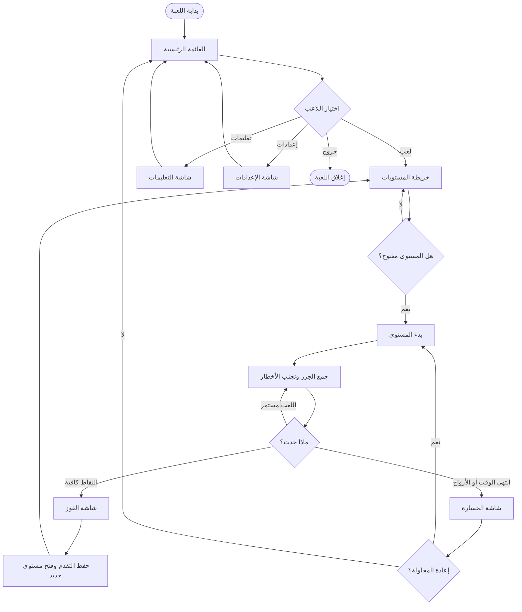
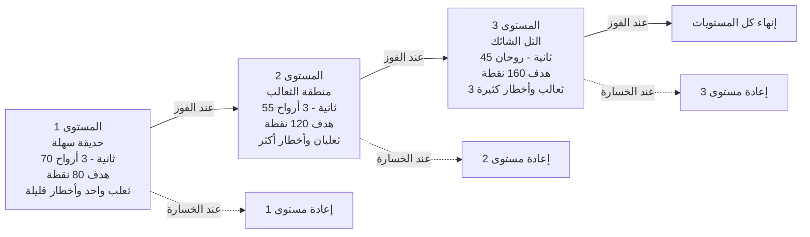

# لعبة الأرنب وجمع الجزر 🐰🥕

هذا الملف يشرح اللعبة باللغة العربية: فكرة اللعبة، طريقة التشغيل، عناصر اللعب، مخطط انسيابي مختصر، مخطط مستويات، وأكواد زائفة لأهم منطق في اللعبة فقط.

## 1. نبذة عن اللعبة

**لعبة الأرنب وجمع الجزر** هي لعبة ثنائية الأبعاد مبنية بمحرك **Godot**. يتحكم اللاعب بأرنب داخل مستوى مليء بالجزر، الجزر الذهبية، الثعالب، الحفر، والأشواك. الهدف هو جمع نقاط كافية قبل انتهاء الوقت مع الحفاظ على الأرواح.

## 2. الهدف الرئيسي

- اجمع الجزر العادية والذهبية لزيادة النقاط.
- حقق النقاط المطلوبة لكل مستوى قبل انتهاء الوقت.
- تجنب الثعالب والحفر والأشواك حتى لا تخسر الأرواح.
- افتح المستويات التالية بعد الفوز.
- اجمع عملة الجزر لشراء وتبديل مظاهر الأرنب.

## 3. طريقة التشغيل

1. افتح المشروع في **Godot 4**.
2. افتح ملف المشروع `project.godot`.
3. شغّل المشهد الرئيسي من المحرر.
4. من القائمة الرئيسية اختر اللعب، ثم اختر المستوى المفتوح.

## 4. التحكم

| الفعل | الأزرار |
| --- | --- |
| الحركة للأعلى | `W` أو السهم للأعلى |
| الحركة للأسفل | `S` أو السهم للأسفل |
| الحركة لليسار | `A` أو السهم لليسار |
| الحركة لليمين | `D` أو السهم لليمين |
| الاندفاع السريع | `Space` أو `Enter` أثناء الحركة |
| الرجوع / الإيقاف المؤقت | `Esc` |

## 5. قواعد اللعب

### 5.1 النقاط والعملات

| العنصر | النقاط | قيمة العملة |
| --- | ---: | ---: |
| جزرة عادية | 10 نقاط | 1 جزرة في المحفظة بعد الفوز |
| جزرة ذهبية | 25 نقطة | 1 جزرة في المحفظة بعد الفوز |

### 5.2 الفوز والخسارة

- يفوز اللاعب إذا وصل إلى النقاط المطلوبة داخل الوقت المحدد.
- يخسر اللاعب إذا انتهى الوقت قبل الوصول إلى النقاط المطلوبة.
- يخسر اللاعب إذا وصلت الأرواح إلى صفر.
- عند الفوز يتم حفظ التقدم، فتح المستوى التالي إن وجد، وإيداع جزر المستوى في المحفظة.

### 5.3 المستويات

| المستوى | الوقت | الأرواح | النقاط المطلوبة | الثعالب | الحفر | الأشواك | الجزر العادية | الجزر الذهبية |
| --- | ---: | ---: | ---: | ---: | ---: | ---: | ---: | ---: |
| 1 | 70 ثانية | 3 | 80 | 1 | 3 | 3 | 12 | 2 |
| 2 | 55 ثانية | 3 | 120 | 2 | 5 | 5 | 16 | 3 |
| 3 | 45 ثانية | 2 | 160 | 3 | 7 | 8 | 20 | 4 |

> ملاحظة: إعداد الصعوبة يغيّر بعض القيم. الصعوبة السهلة تزيد الوقت والأرواح وتقلل النقاط المطلوبة، أما الصعوبة الصعبة فتقلل الوقت والأرواح وتزيد النقاط المطلوبة.

## 6. مكونات اللعبة

| المكون | الوصف |
| --- | --- |
| مدير اللعبة | يحفظ النقاط، الأرواح، الوقت، المستوى الحالي، التقدم، المحفظة، والمظاهر المملوكة. |
| اللاعب | أرنب قابل للحركة والاندفاع، وله فترة حماية قصيرة بعد الضرر. |
| الجزر | عناصر قابلة للجمع تعطي نقاطاً وعملة. |
| الثعالب | أعداء يطاردون اللاعب وتسبب فقدان حياة عند الاصطدام. |
| المخاطر الثابتة | حفر أو أشواك تسبب فقدان حياة عند لمسها. |
| شاشة المعلومات | تعرض النقاط، الوقت، المستوى، والأرواح. |
| خريطة المستويات | تعرض المستويات المفتوحة والمغلقة. |
| المتجر / المظاهر | يسمح بشراء أو تجهيز مظاهر الأرنب باستخدام جزر المحفظة. |
| الإعدادات | تتحكم بالصوت، اللغة، الصعوبة، ملء الشاشة، والدقة. |

## 7. مخطط اللعبة العام

هذا مخطط عادي ومختصر يوضح مسار اللعبة من القائمة إلى نهاية المستوى، بدون الدخول في تفاصيل كل زر أو كل ملف.



## 8. مخطط المستويات

هذا المخطط يوضح ماذا يحدث في كل مستوى بشكل مختصر: الصعوبة تزيد تدريجياً، الوقت يقل، الأخطار تزيد، والهدف يصبح أعلى.



### ملخص سريع لكل مستوى

| المستوى | ماذا يحدث؟ | المطلوب من اللاعب |
| --- | --- | --- |
| المستوى 1 | بداية بسيطة للتعلم، أخطار قليلة وثعلب واحد. | جمع 80 نقطة والتعود على الحركة والاندفاع. |
| المستوى 2 | الخريطة تصبح أخطر، عدد الثعالب والحفر والأشواك يزيد. | جمع 120 نقطة بسرعة أكبر مع تجنب ثعلبين. |
| المستوى 3 | أصعب مستوى: وقت أقل، أرواح أقل، وأخطار كثيرة. | جمع 160 نقطة بحذر واستخدام الاندفاع بذكاء. |

## 9. أكواد زائفة لأهم منطق في اللعبة فقط

هذه الأكواد الزائفة ليست لكل التفاصيل الصغيرة، بل لأهم الأشياء التي تصف اللعبة كاملة: بدء المستوى، حلقة اللعب، الفوز والخسارة، وحفظ التقدم.

### 9.1 بدء المستوى

```text
إجراء بدء_المستوى(رقم_المستوى):
    اجلب بيانات المستوى: الوقت، الأرواح، الهدف، عدد الجزر، وعدد الأخطار
    اجعل نقاط اللاعب = 0
    اجعل أرواح اللاعب = أرواح المستوى
    اجعل الوقت المتبقي = وقت المستوى
    أنشئ اللاعب في مكان آمن
    وزع الجزر والأخطار والثعالب داخل الخريطة
    شغّل موسيقى اللعب
    ابدأ حلقة اللعب
نهاية الإجراء
```

### 9.2 حلقة اللعب الأساسية

```text
طالما المستوى يعمل:
    اقرأ حركة اللاعب
    حرّك الأرنب داخل حدود الخريطة

    إذا ضغط اللاعب زر الاندفاع وكان الاندفاع جاهزاً:
        نفّذ اندفاعاً قصيراً وسريعاً

    حرّك الثعالب باتجاه اللاعب

    إذا لمس اللاعب جزرة:
        أضف نقاط الجزرة إلى المجموع
        أضف جزرة إلى مكافأة المستوى
        أخفِ الجزرة من الخريطة

    إذا لمس اللاعب ثعلباً أو حفرة أو أشواكاً ولم يكن محمياً:
        أنقص حياة واحدة
        فعّل حماية مؤقتة حتى لا يخسر أكثر من حياة مباشرة

    قلل الوقت المتبقي

    إذا وصلت النقاط إلى هدف المستوى:
        انتقل إلى الفوز

    إذا انتهى الوقت أو أصبحت الأرواح صفراً:
        انتقل إلى الخسارة
نهاية طالما
```

### 9.3 الفوز بالمستوى

```text
إجراء الفوز:
    أوقف المؤقت وحركة المستوى
    احسب تقييم اللاعب حسب النقاط
    أضف جزر المستوى إلى محفظة اللاعب
    افتح المستوى التالي إذا كان موجوداً
    احفظ التقدم
    اعرض شاشة الفوز
نهاية الإجراء
```

### 9.4 الخسارة

```text
إجراء الخسارة:
    أوقف المؤقت وحركة المستوى
    لا تضف جزر المستوى إلى المحفظة
    اعرض شاشة الخسارة
    إذا اختار اللاعب إعادة المحاولة:
        ابدأ نفس المستوى من جديد
    وإلا:
        ارجع إلى القائمة الرئيسية
نهاية الإجراء
```

### 9.5 شراء مظهر الأرنب

```text
إجراء شراء_مظهر(المظهر):
    إذا كان المظهر مملوكاً:
        جهّزه مباشرة
    وإلا إذا كانت الجزر في المحفظة كافية:
        اطرح السعر من المحفظة
        أضف المظهر إلى المظاهر المملوكة
        جهّز المظهر
        احفظ التقدم
    وإلا:
        اعرض رسالة أن الجزر غير كافية
نهاية الإجراء
```

## 10. بنية الملفات المهمة

```text
project.godot                 ملف إعداد مشروع Godot
scenes/MainMenu.tscn          مشهد القائمة الرئيسية
scenes/LevelMap.tscn          مشهد خريطة المستويات
scenes/GameLevel.tscn         مشهد اللعب الأساسي
scenes/Player.tscn            مشهد اللاعب
scenes/Fox.tscn               مشهد الثعلب
scenes/Carrot.tscn            مشهد الجزرة
scenes/Hole.tscn              مشهد الحفرة
scenes/Thorn.tscn             مشهد الأشواك
scripts/game_manager.gd       مدير حالة اللعبة والتقدم
scripts/player.gd             منطق حركة اللاعب والاندفاع والضرر
scripts/game_level.gd         منطق المستوى وإنشاء العناصر والإيقاف المؤقت
scripts/collectible_carrot.gd منطق الجزر والنقاط
scripts/enemy_fox.gd          منطق الثعلب والمطاردة
scripts/hazard.gd             منطق المخاطر الثابتة
scripts/hud.gd                واجهة عرض النقاط والوقت والأرواح
scripts/settings_manager.gd   إدارة الإعدادات والنصوص
```

## 11. ملاحظات تطويرية

- استخدم الإشارات بين مدير اللعبة والواجهة لتحديث النقاط والأرواح والوقت.
- اجعل منطق الفوز والخسارة مركزياً في مدير اللعبة حتى لا يتكرر في أكثر من ملف.
- عند إضافة مستوى جديد، أضف إعداداته إلى قائمة إعدادات المستويات، ثم أضف زر المستوى أو طريقة الوصول إليه.
- عند إضافة عدو جديد، اجعله يلتزم بفكرة: اكتشاف اللاعب، الحركة، الاصطدام، وفترة تبريد الضرر.
- عند إضافة عنصر جمع جديد، حدد نقاطه وقيمته كعملة وسلوكه البصري عند الجمع.
